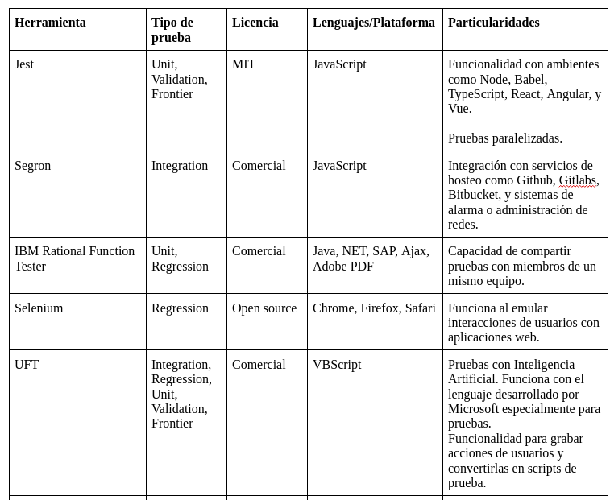
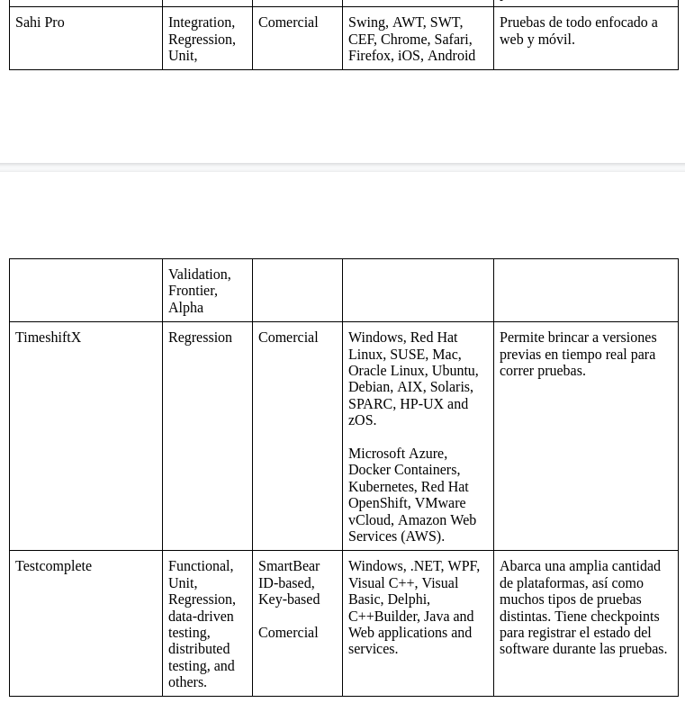
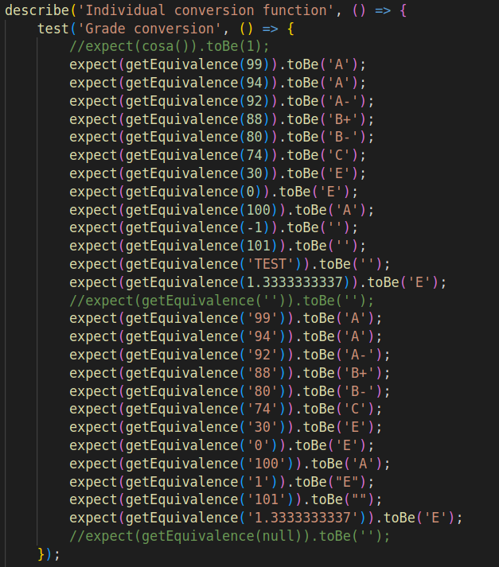
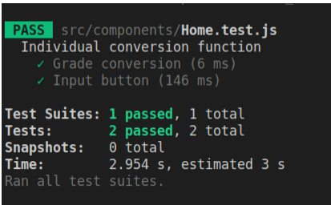

# Getting Started with Create React App

This project was bootstrapped with [Create React App](https://github.com/facebook/create-react-app).

## Installing missing modules to run this app

In a new terminal, make sure to run the following commands: 

### `npm install react-router-dom@6`
### `npm install papaparse`

## Available Scripts

In the project directory, you can run:

### `npm start`

Runs the app in the development mode.\
Open [http://localhost:3000](http://localhost:3000) to view it in your browser.

The page will reload when you make changes.\
You may also see any lint errors in the console.

### `npm test`

Launches the test runner in the interactive watch mode.\
See the section about [running tests](https://facebook.github.io/create-react-app/docs/running-tests) for more information.

### `npm run build`

Builds the app for production to the `build` folder.\
It correctly bundles React in production mode and optimizes the build for the best performance.

The build is minified and the filenames include the hashes.\
Your app is ready to be deployed!

See the section about [deployment](https://facebook.github.io/create-react-app/docs/deployment) for more information.

### `npm run eject`

**Note: this is a one-way operation. Once you `eject`, you can't go back!**

If you aren't satisfied with the build tool and configuration choices, you can `eject` at any time. This command will remove the single build dependency from your project.

Instead, it will copy all the configuration files and the transitive dependencies (webpack, Babel, ESLint, etc) right into your project so you have full control over them. All of the commands except `eject` will still work, but they will point to the copied scripts so you can tweak them. At this point you're on your own.

You don't have to ever use `eject`. The curated feature set is suitable for small and middle deployments, and you shouldn't feel obligated to use this feature. However we understand that this tool wouldn't be useful if you couldn't customize it when you are ready for it.

## Learn More

You can learn more in the [Create React App documentation](https://facebook.github.io/create-react-app/docs/getting-started).

To learn React, check out the [React documentation](https://reactjs.org/).

### Code Splitting

This section has moved here: [https://facebook.github.io/create-react-app/docs/code-splitting](https://facebook.github.io/create-react-app/docs/code-splitting)

### Analyzing the Bundle Size

This section has moved here: [https://facebook.github.io/create-react-app/docs/analyzing-the-bundle-size](https://facebook.github.io/create-react-app/docs/analyzing-the-bundle-size)

### Making a Progressive Web App

This section has moved here: [https://facebook.github.io/create-react-app/docs/making-a-progressive-web-app](https://facebook.github.io/create-react-app/docs/making-a-progressive-web-app)

### Advanced Configuration

This section has moved here: [https://facebook.github.io/create-react-app/docs/advanced-configuration](https://facebook.github.io/create-react-app/docs/advanced-configuration)

### Deployment

This section has moved here: [https://facebook.github.io/create-react-app/docs/deployment](https://facebook.github.io/create-react-app/docs/deployment)

### `npm run build` fails to minify

This section has moved here: [https://facebook.github.io/create-react-app/docs/troubleshooting#npm-run-build-fails-to-minify](https://facebook.github.io/create-react-app/docs/troubleshooting#npm-run-build-fails-to-minify)

---

# Investigación de tipos de pruebas

Hay varios tipos de pruebas que se pueden realizar en un programa. Principalmente:

### 1. Pruebas unitarias.

Este tipo de pruebas se centran en probar piezas/unidades individuales de una aplicación al principio del SDLC (Software Development Life Cycle). Cualquier función, procedimiento, método o módulo puede ser una unidad que se someta a pruebas unitarias para determinar su corrección y comportamiento esperado. Las pruebas unitarias son las primeras pruebas que los desarrolladores realizan durante la fase de desarrollo.(Loadview, 2016)

### 2. Pruebas de integración.

Las pruebas de integración entran en la categoría de pruebas funcionales, esto quiere decir que comprueba las características críticas para el negocio, la funcionalidad y la usabilidad. Garantizan que las características y funcionalidades del software se comportan según lo esperado sin ningún problema. Válida principalmente la aplicación con respecto a las especificaciones mencionadas en el documento Software Requirement Specification (SRS).

El objetivo de las pruebas de integración es validar las interfaces o puntos de integración entre funciones o componentes individuales. Implican probar diferentes módulos de una app de software como grupo. La aplicación de software se compone de diferentes submódulos que trabajan juntos para diferentes funcionalidades. El propósito es validar la integración de diferentes módulos juntos e identificar los errores y problemas relacionados con ellos. (Lee, 2020)

Se debe definir un punto de control que describa los criterios de los criterios de entrada para las pruebas de integración. Los puntos de control pueden ser diferentes para cada proyecto. 
Los testers pueden reutilizar archivos de prueba existentes para pruebas de unidad para construir pruebas de integración. (IBM Documentation, 2021)

### 3. Pruebas alfa.

Las pruebas alfa se realizan a partir de haber realizado pruebas unitarias y de integración. Sigue un proceso de iteración para asegurar un funcionamiento más refinado del producto, y suele ser una de las fases finales de pruebas. Dicho proceso consiste de los siguientes pasos:

- Revisión de requerimientos
- Desarrollo de pruebas
- Diseño de casos de prueba
- Registro de defectos
- Arreglo de bugs
- Realización de pruebas

La realización de pruebas alfa se realiza en 2 fases:

- Fase 1: realización de pruebas por el equipo interno de desarrolladores, utilizando hardware o un ambiente óptimo para realizar debugging.
- Fase 2: realización de pruebas por desarrolladores y testers externos al equipo de desarrolladores, involucrando a personal de Quality Assurance.

### 4. Pruebas de regresión.

Las pruebas de regresión son pruebas realizadas posterior a un cambio para garantizar que el cambio no ha resultado en nuevas fallas. Al ser una repetición de pruebas previas, se tienen que realizar de manera periódica. Hay dos tipos:

- Full Regression: Una repetición de todas las pruebas realizadas previamente. Usualmente se reserva para el final del desarrollo de una nueva versión del programa, ya que pueden tomar mucho tiempo.
- Partial Regression: Una repetición de las pruebas relevantes a lo que se haya cambiado.
(Chavarria, A).

### 5. Pruebas dinámicas de validación.

Las pruebas de validación son aquellas que verifican si el programa cumple con los requerimientos preestablecidos por el desarrollador o el cliente. Las pruebas dinámicas son aquellas que se realizan mientras el programa se ejecuta. Por lo tanto, las pruebas dinámicas de validación implican utilizar el programa y realizar una serie de pruebas para garantizar que se cumplen sus requisitos dentro de los parámetros preestablecidos (Ayapalda & Bernal, 2018)(Herrera, 2019).

### 6. Pruebas bajo condiciones frontera.

Las pruebas bajo condiciones fronterizas son aquellas que prueban los límites establecidos en el programa para garantizar que funcionen en situaciones extremas. Por ejemplo, si una función no puede recibir un valor numérico mayor a mil, entonces se corre la función con mil como parámetro.

## Herramientas de prueba automatizadas

Para eficientar la realización de las pruebas se automatizan con el uso de diversas herramientas. Estas herramientas se pueden encontrar en la tabla de abajo, con su tipo de prueba correspondiente, licencia (comercial u open source), plataforma y/o lenguajes y sus particularidades.

## Aplicación de herramienta de pruebas: Jest
Para probar el uso de las herramientas automatizadas se seleccionó Jest por su facilidad de uso y por su licencia open source. Esta herramienta se aplicó para realizar pruebas unitarias sobre una aplicación de React que toma un archivo .csv y convierte su información para generar un nuevo conjunto de datos.
	
Las pruebas en sí se crearon en un script (archivo .test.js) y se aplicaron a funciones utilizando valores dentro de rango.

## Referencias
- Ayabaca, L.L.P. & Bernal, S.A.M. (2018). Verificación, validación y pruebas de software. 
Killkana Técnica, 1(29). Recuperado de 
https://www.researchgate.net/publication/322876470_Verificacion_validacion_y_prue
bas_de_software 
‌
- Chavarria, A. (2018). Pruebas de Regresión: 6 Recomendaciones para una buena 
planificación. Encora. Recuperado de 
https://www.encora.com/es/blog/pruebas-de-regresion-6-recomendaciones-para-una-b
uena-planificacion

- Herrera, C.L. (2019). Qué es el Testing de Software. Open Webinars. Recuperado de 
https://openwebinars.net/blog/que-es-el-testing-de-software/

- IBM Documentation. (2021, March 5). Ibm.com. 
https://www.ibm.com/docs/es/rtw/9.0.1?topic=phases-integration-testing

- Lee, G. (2020, October 16). Tipos de pruebas de software: diferencias y ejemplos. LoadView 
by Dotcom-Monitor. Recuperado de 
https://www.loadview-testing.com/es/blog/tipos-de-pruebas-de-software-diferencias-y
-ejemplos/

- LoadView. (2016). Tipos de pruebas de software: diferencias y ejemplos. Recuperado de 
https://www.loadview-testing.com/es/blog/tipos-de-pruebas-de-software-diferencias-y
-ejemplos/
