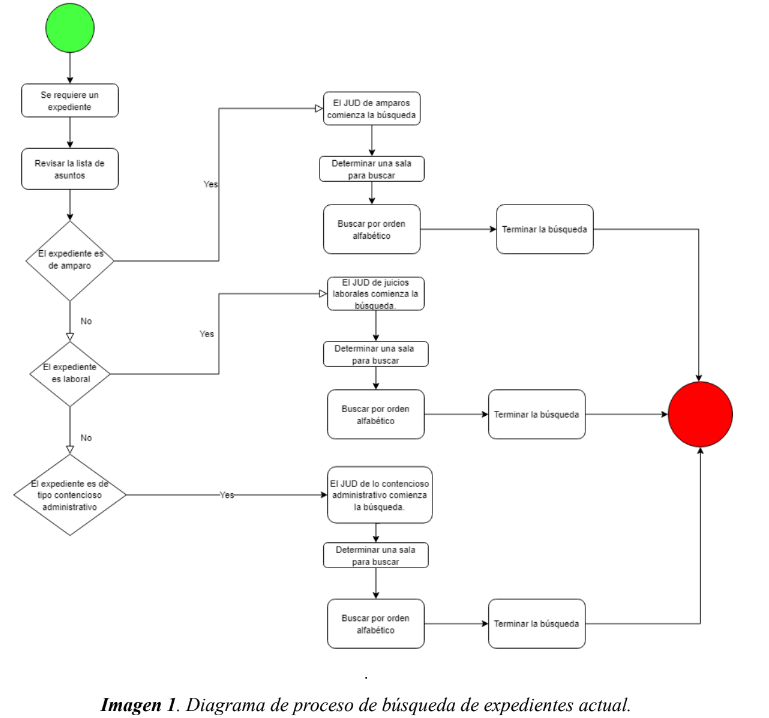
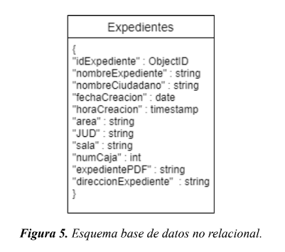
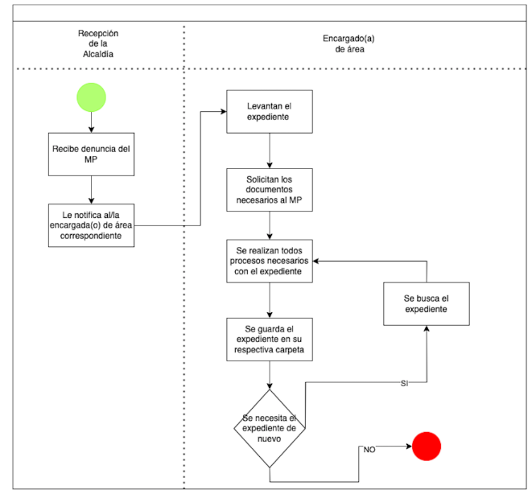
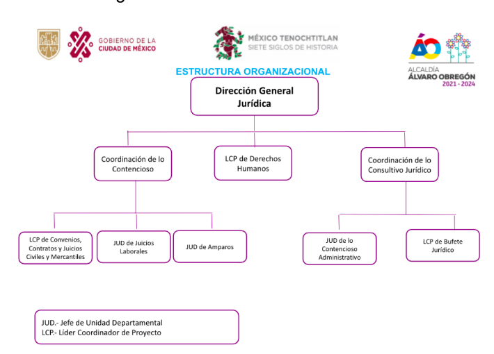

# Notas de propuestas a AO

## Tabla de contenidos
1. [Equipo 1](#equipo1)
    - [Tabla de tiempo de búesqueda por area](#tabla-de-tiempo-de-búesqueda-por-area)
2. [Equipo 2](#equipo-2)
    - [Proceso de búsqueda de expedientes](#proceso-de-búsqueda-de-expedientes)
    - [Esquema de base de datos no relacional](#esquema-de-base-de-datos-no-relacional)
3. [Equipo 3](#equipo-3)
    - [Proceso de documentación actual](#proceso-de-documentación-actual)
4. [Equipo 4](#equipo-4)
    - [Estructura organizacional](#estructura-organizacional)
5. [Equipo 5](#equipo-5)
    - [KPIs](#kpis-propuestos)

## Equipo 1

- 1050 documentos/expedientes de entre 10 a 50 páginas en el área:
    * Legal
    * Penal
    * Jurídica
    * Laboral
- Búsquedas de documentos de hasta 2 horas

- **Búsqueda de expediente:** Primero se revisa la lista de asuntos, dependiendo el área: amparo, laboral, civil, juicios de nulidad, acción pública o lesividad.

- Los expedientes más solicitados son los penales con 33 consultas mensuales

- Los menos requieridos son los jurídicos.

- Los expedientes que se tardan más en hacer son los jurídicos, debido al proceso que conllevades de el testimonio de la víctima, que tan relevante es, y si el interés del caso es legítimo o no, tomando un alrededor de **45 minutos** para su creación.

### Tabla de tiempo de búesqueda por area

- Les mencionaron que prefieren usar libretas que software ya que han tenido malas experiencias con software con muchos errores.

- Sugieren implementar drag and drop para subir los documentos

- Proponen usar minería de texto con OpenKM, así como el uso de códigos de barras

## Equipo 2

- La alcaldía lleva un registro de 873 expedientes desde el año 2015 hasta la fecha

- Hay tres departamentos: coordinación de lo contenciosos, derechos humanos y la coordinación de lo consultivo jurídico. Dentro de cada coordinación se derivan 3 y 2 departamentos más, en ese respectivo orden.

- No se quiere tener los datos en la nube por razones de seguridad

- Conocimiento limitado en el area de tecnología del personal de la alcaldía

- Resistencia al cambio por parte del personal

- Seguir ley de archivos de la Ciudad de México

- Todo el personal de base, nómina y estructura tiene permiso para revisar los expedientes.

- La coordinación de lo contencioso y la coordinación de lo consultivo cuentan con 18 computadoras cada una, pero tienen sistemas operativos viejos

### Proceso de búsqueda de expedientes

- Se recomienda que se tenga un registro tanto físico como digital para todos los expedientes

- Proponen usar una base de datos noSQL, así como un servidor de búsqueda multiplataforma llamado Solr. 

### Esquema de base de datos no relacional

- Planean usar Adobe Acrobat para poder escanear los documentos, pero se tienen que instalar en cada computadora

- El documento de este equipo cuenta con un WBS, diagrama de proceso de escaneo, del proceso de búsqueda de documentos, ruta crítica y risk plan

- Métodos de sort propuestos: 
    * Alfabético
    * Por número de expediente
    * Por caja
    * Por fecha de creación
- Filtros de búsqueda propuestos:
    * Número de folio.
    * Número de sala para expedientes del área laboral.
    * Número de expediente o de sección para expedientes del área de contencioso.
    * Número de expediente o juzgado para expedientes del área de amparo.
    * Número de expediente o actor para expedientes del área civil.
    * Existe la manera de filtrar una búsqueda con palabras, e.g. todos los expedientes que tengan como actor el apellido “Rodríguez”.
    * Asunto del expediente.

## Equipo 3

- Uno de los principales retos ha sido el presupuesto, pues la ley les pide tener digitalizados los documentos pero no les da los fondos para llevarlo a cabo. También está la parte del seguimiento dado que el cambio de gobierno se hace cada 3 años.

- La transformación digital considera su tecnología, procesos y su cultura.

- La idea es que sea adaptable a la cultura acutal y poco intrusiva, pues muchos lo pueden ver como más trabajo en lugar de como una solución

### Proceso de documentación actual

- Proponen usar Paperwork para escanear y tener un sistema de búsqueda de documentos. Con esa propuesta planean reducir la búsqueda a 15 minutos

- Mencionan hacer un manual de uso para los usuarios 

## Equipo 4

### Estructura organizacional

- Proponen almacenar los datos en un programa llamado Mayan EDMS, al igual que el uso de códigos QR para ubicar los archivos físicamente.

## Equipo 5

- Proponen hacer una organización física del los archivos primero, para luego proceder a la herramienta digital, donde la base de datos contemplará:

    * ID
    * ID de la alcaldía
    * Fecha de creación
    * Materia
    * Estatus
    * Path
    * Caja

- Posteriormente se pasará a la digitalización de archivos

### KPIs propuestos

- Tiempo de búsqueda por expediente solicitado.
- Encuestas de satisfacción realizadas a los usuarios del sistema.
- Tiempo promedio de cierre por caso.
- % de expedientes que cuentan con acceso de forma digital.
- % de solicitudes que llegan desde la P0 (Landing Page) hasta la P4 (Vista del Expediente).