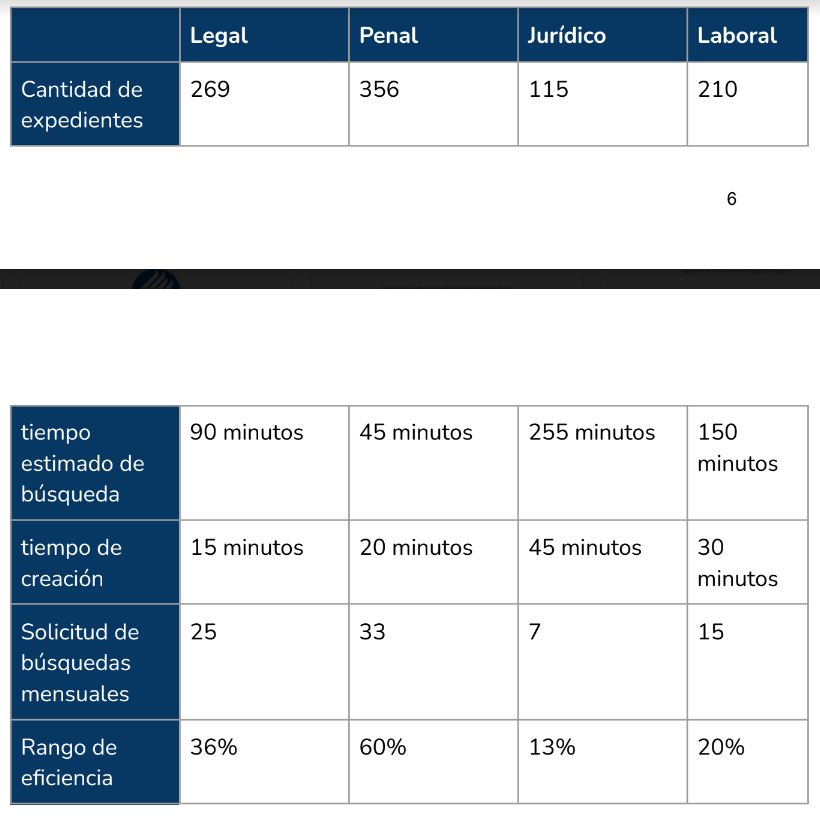

# Notas de propuestas a AO

## Tabla de contenidos
1. [Equipo 1](#equipo1)
    - [Tabla de tiempo de búesqueda por area](#tabla-de-tiempo-de-búesqueda-por-area)
2. [Equipo 2](#equipo-2)

## Equipo 1

- 1050 documentos/expedientes de entre 10 a 50 páginas en el área:
    * Legal
    * Penal
    * Jurídica
    * Laboral
- Búsquedas de documentos de hasta 2 días

- **Búsqueda de expediente:** Primero se revisa la lista de asuntos, dependiendo el área: amparo, laboral, civil, juicios de nulidad, acción pública o lesividad.

- Los expedientes más solicitados son los penales con 33 consultas mensuales

- Los menos requieridos son los jurídicos.

- Los expedientes que se tardan más en hacer son los jurídicos, debido al proceso que conllevades de el testimonio de la víctima, que tan relevante es, y si el interés del caso es legítimo o no, tomando un alrededor de **45 minutos** para su creación.

### Tabla de tiempo de búesqueda por area

- Les mencionaron que prefieren usar libretas que software ya que han tenido malas experiencias con software con muchos errores.

- Sugieren implementar drag and drop para subir los documentos

- Proponen usar minería de texto con OpenKM, así como el uso de códigos de barras

## Equipo 2
